<h1 align="center"><b>guihojak</b></h1>

<h3 align="center">Sistemas de Informação Student @ Unipar</h3>

  🚀 <b>Software Developer | AI Enthusiast | Frontend </b> 
  Auxiliar no Desenvolvimento de Sistemas na <b>Tooling Equipamentos Ópticos</b> e Colaborador na <b>Lansutech</b>.

  
  

---

### 🛠️ Tech Stack & Expertise

  

 

<table width="100%" align="center">
  <tr>
    <td width="55%" valign="top">
      <h3>📊 Infográfico de Performance</h3>
      
    </td>
  </tr>
</table>

 
<h3>🔥 Streak Atual</h3>

  

 

<h3>🐍 Atividade no GitHub</h3>
  

      
  

---

### 🔭 Experiência Profissional
- 🛠️ **Tooling Equipamentos Ópticos:** Focado em soluções de software para o setor industrial/óptico.
- 🌐 **Lansutech:** Desenvolvimento de aplicações modernas e escaláveis.

  

